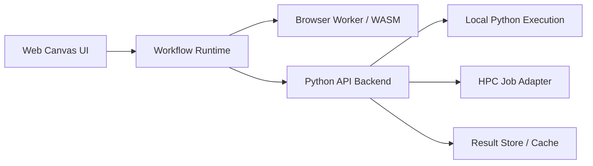

# Web Workflow Migration Plan

This document outlines a practical path for turning the current Orange-based `chem-inf-widgets` add-on into a web workflow platform with a similar node-based user experience.

The goal is not a 1:1 browser clone of Orange. The goal is a hybrid workflow system with:

- a web canvas for composing workflows
- browser-local execution for light cheminformatics operations
- Python backend execution for service-heavy workflows
- optional HPC offloading for expensive descriptor, modeling, and enumeration jobs

## Why this is now realistic

The codebase has already moved in the right direction:

- Orange widget logic lives mainly in [`src/chem_inf_widgets/widgets`](/Users/crtomir/Desktop/cinf/src/chem_inf_widgets/widgets)
- reusable chemistry and table logic lives mainly in [`src/chem_inf_widgets/chemcore/services`](/Users/crtomir/Desktop/cinf/src/chem_inf_widgets/chemcore/services)
- repeated RDKit parsing has been consolidated through [`rdkit_safe.py`](/Users/crtomir/Desktop/cinf/src/chem_inf_widgets/chemcore/services/rdkit_safe.py)
- Orange-table conversion is increasingly centralized in [`from_orange.py`](/Users/crtomir/Desktop/cinf/src/chem_inf_widgets/chemcore/services/from_orange.py)

That means the frontend can be redesigned without rewriting the chemistry core first.

## Target architecture



## Design principles

1. Keep workflow composition in the browser.
2. Run only fast, bounded chemistry tasks in the browser.
3. Keep heavy scientific Python tasks in Python.
4. Treat HPC as an execution backend, not as a separate product.
5. Use one shared workflow schema for browser, backend, and saved projects.

## Recommended execution split

### Browser / WASM / Web Worker

Good candidates:

- molecule drawing and editing
- SMILES parsing and canonicalization
- basic substructure preview
- lightweight fingerprint generation
- lightweight descriptor preview
- local filtering and sorting
- compound detail visualization
- similarity search on small datasets

Recommended technologies:

- `Ketcher` for structure editing
- `RDKit.js` or RDKit WebAssembly build
- `3Dmol.js` for 3D viewing
- Web Workers for non-blocking local compute

### Python backend

Good candidates:

- QSAR model training and validation
- descriptor pipelines with RDKit, Mordred, PaDEL, ISIDA
- ChEMBL integration and bulk data enrichment
- scaffold analytics on larger datasets
- matched molecular pairs
- reaction enumeration
- applicability domain calculations
- report generation

Recommended technologies:

- `FastAPI`
- `Pydantic` models for workflow contracts
- background jobs via `RQ`, `Celery`, or `Arq`
- Parquet or Arrow for table payloads

### HPC backend

Good candidates:

- very large descriptor jobs
- hyperparameter optimization
- batch QSAR screening
- large reaction library generation
- large similarity or clustering jobs

Recommended integration:

- Slurm adapter first
- optional PBS adapter later
- backend-managed job submission and polling

## Web workflow model

The web product should use explicit node categories similar to the current Orange layout:

- `Cheminf - Data`
- `Cheminf - Processing`
- `Cheminf - Modeling`

Each node should declare:

- `node_type`
- `version`
- `inputs`
- `outputs`
- `settings`
- `execution_target`
- `resource_profile`

Suggested execution targets:

- `browser`
- `backend`
- `hpc`
- `auto`

## Proposed project split

```text
web/
  frontend/
    src/
      canvas/
      nodes/
      inspectors/
      datasets/
      workers/
      api/
  backend/
    app/
      api/
      workflows/
      jobs/
      schemas/
      execution/
      hpc/
  shared/
    workflow-schema/
    examples/
```

## Backend reuse from current package

The current codebase already contains strong backend candidates:

- [`src/chem_inf_widgets/chemcore/services/rdkit_safe.py`](/Users/crtomir/Desktop/cinf/src/chem_inf_widgets/chemcore/services/rdkit_safe.py)
- [`src/chem_inf_widgets/chemcore/services/from_orange.py`](/Users/crtomir/Desktop/cinf/src/chem_inf_widgets/chemcore/services/from_orange.py)
- [`src/chem_inf_widgets/chemcore/services/mol_standardizer.py`](/Users/crtomir/Desktop/cinf/src/chem_inf_widgets/chemcore/services/mol_standardizer.py)
- [`src/chem_inf_widgets/chemcore/services/qsar_regression_service.py`](/Users/crtomir/Desktop/cinf/src/chem_inf_widgets/chemcore/services/qsar_regression_service.py)
- [`src/chem_inf_widgets/chemcore/services/compound_detail_service.py`](/Users/crtomir/Desktop/cinf/src/chem_inf_widgets/chemcore/services/compound_detail_service.py)
- [`src/chem_inf_widgets/chemcore/services/substructure_search_service.py`](/Users/crtomir/Desktop/cinf/src/chem_inf_widgets/chemcore/services/substructure_search_service.py)
- [`src/chem_inf_widgets/chemcore/services/reaction_enumerator_service.py`](/Users/crtomir/Desktop/cinf/src/chem_inf_widgets/chemcore/services/reaction_enumerator_service.py)

## Widget-to-node migration map

| Current widget | Web node | Target execution | Notes |
| --- | --- | --- | --- |
| `SDF Reader` | File Import | backend | Parse in Python, deliver normalized dataset |
| `SDF Writer` | File Export | backend | Export remains Python-side |
| `Mol Editor` / `Mol Ketcher` | Structure Editor | browser | Ketcher-native |
| `Molecular Viewer` | Molecule Viewer | browser | 2D render in browser |
| `3D Molecular Viewer` | 3D Viewer | browser | `3Dmol.js` candidate |
| `Compound Detail Card` | Compound Card | browser + backend data | UI in browser, chemistry data from backend or WASM |
| `Mol Standardizer` | Standardizer | browser or backend | browser for small jobs, backend for bulk |
| `Fingerprint Generator` | Fingerprints | browser or backend | depends on dataset size |
| `Similarity Search` | Similarity Search | browser or backend | browser for small tables, backend for large |
| `Substructure Search` | Substructure Search | browser or backend | backend preferred for larger inputs |
| `Scaffold Analysis` | Scaffold Analysis | backend | Python-side first |
| `Scaffold Splitter` | Scaffold Splitter | backend | deterministic service candidate |
| `Drug Filter` | Drug Filter | browser or backend | hybrid |
| `PaDEL Descriptors` | PaDEL Descriptors | backend or hpc | not a browser target |
| `ISIDA Descriptors` | ISIDA Descriptors | backend or hpc | not a browser target |
| `Mol Descriptors 2` | RDKit Descriptors | browser or backend | hybrid |
| `QSAR Regression` | QSAR Modeling | backend or hpc | keep in Python |
| `MLR Model Selection` | MLR Selection | backend or hpc | keep in Python |
| `Applicability Domain` | AD Analysis | backend | Python-side |
| `Activity Cliff Finder` | Activity Cliffs | backend | service-heavy |
| `Matched Molecular Pairs` | MMP Analysis | backend or hpc | expensive |
| `Reaction Enumerator` | Reaction Enumeration | backend or hpc | expensive |
| `Reactor` | Reaction Apply | backend | backend first |
| `ChEMBL Browser` | ChEMBL Search | backend | API integration stays server-side |
| `ChEMBL Bioactivity Retriever` | ChEMBL Retrieval | backend | API integration stays server-side |

## Dataset contract

Orange `Table` should not be the primary web transport.

Recommended web dataset contract:

- table metadata in JSON
- row/column payload in Arrow or Parquet
- optional molecule preview cache
- stable chemistry columns from the Phase 1–2 contract

The molecule-facing fields should include at least:

- `mol_id`
- `input_smiles`
- `canonical_smiles`
- `standardized_smiles`
- `inchikey`
- `source_row_index`
- `qc_status`
- `qc_issue_codes`

This aligns with the stabilization direction documented in [phase1_phase2_stabilization.md](/Users/crtomir/Desktop/cinf/docs/development/phase1_phase2_stabilization.md).

## Workflow schema

Saved workflows should move to a JSON-based schema.

Suggested top-level structure:

```json
{
  "version": "1.0",
  "nodes": [],
  "edges": [],
  "datasets": {},
  "runtime": {
    "execution_mode": "hybrid"
  }
}
```

Each node should include:

```json
{
  "id": "node-1",
  "type": "qsar_regression",
  "category": "Cheminf - Modeling",
  "settings": {},
  "execution_target": "backend"
}
```

## Execution policy

The frontend should not hardcode where a node runs. It should ask a runtime policy layer.

Suggested policy inputs:

- dataset row count
- descriptor count
- estimated memory footprint
- requested node type
- user preference: local vs backend vs HPC

Suggested decisions:

- small fingerprint task on 200 molecules: `browser`
- QSAR cross-validation on 10k descriptors: `backend`
- large hyperparameter optimization: `hpc`

## UI model

The web UI should imitate Orange where that helps users, but not copy it blindly.

Recommended UI pieces:

- left node palette grouped by `Cheminf - Data`, `Cheminf - Processing`, `Cheminf - Modeling`
- center workflow canvas using `React Flow`
- right inspector panel for node settings
- bottom run log / job status panel
- node badges for execution target: local, backend, HPC

## Security and privacy

Important for chemistry workflows:

- allow local-only mode for private datasets
- do not upload structures by default if local execution is possible
- require explicit opt-in for HPC submission
- log which execution target was used for each node

## Recommended implementation phases

### Phase A: backend extraction

Goals:

- expose selected `chemcore/services` through a thin FastAPI layer
- define JSON/Pydantic request-response contracts
- keep Orange working unchanged

Deliverables:

- backend service package
- API for standardization, fingerprints, similarity, QSAR

### Phase B: web proof of concept

Goals:

- build a small browser workflow canvas
- implement 4 to 6 nodes
- run simple nodes locally and one heavy node on backend

Suggested first nodes:

- File Import
- Structure Editor
- Standardizer
- Fingerprint Generator
- Similarity Search
- QSAR Regression

### Phase C: workflow persistence and job orchestration

Goals:

- save/load web workflows
- background jobs
- resumable runs
- progress and cancellation

### Phase D: HPC execution

Goals:

- Slurm-backed job adapter
- job status and result retrieval
- cost-aware routing for large jobs

### Phase E: advanced chemistry UI

Goals:

- richer compound card
- report builder
- dataset comparison dashboards
- teaching mode and guided workflows

## Key risks

### Risk: trying to run everything in WASM

This will likely fail on realistic QSAR and descriptor workloads.

Mitigation:

- keep browser execution for small, interactive tasks only

### Risk: Orange `Table` assumptions leaking into web runtime

Mitigation:

- introduce a web-native dataset contract early

### Risk: duplicate logic between Orange and web backends

Mitigation:

- keep chemistry logic in `chemcore/services`
- keep UI-specific logic in frontend or widget layer only

### Risk: HPC becoming a separate code path

Mitigation:

- make HPC just another execution adapter behind the same job API

## Best next step

The best next engineering step is a proof-of-concept hybrid workflow:

1. extract backend endpoints for standardization, fingerprints, similarity, and QSAR
2. define a first JSON workflow schema
3. build a minimal browser canvas with 4 to 6 nodes
4. run lightweight chemistry locally with RDKit WASM
5. run QSAR on the backend

That would validate the architecture without committing yet to a full rewrite.
